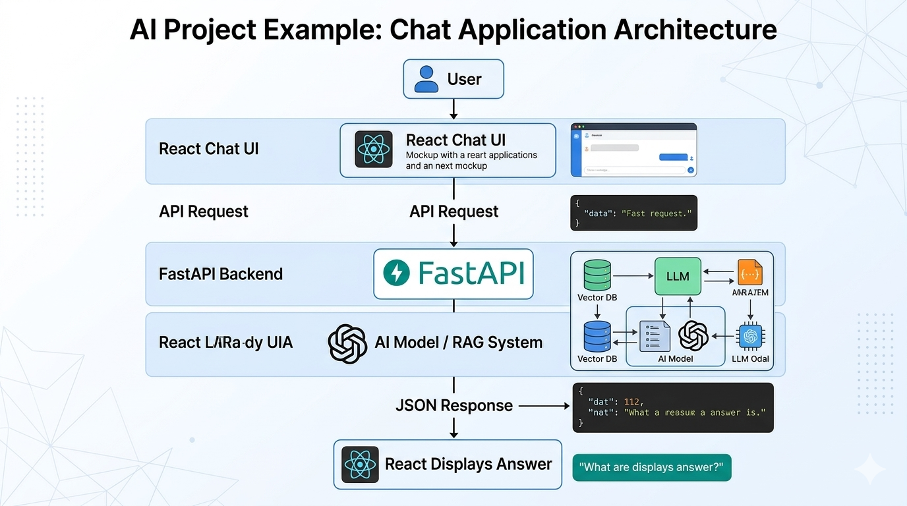

# Nepal Constitution Chatbot

A comprehensive Retrieval-Augmented Generation (RAG) chatbot designed to answer complex legal and structural questions based on the **Constitution of Nepal (2015)**. The chatbot uses a robust hybrid search mechanism to accurately retrieve and synthesize information from the official 240-page PDF document.



## 🏗️ Architecture

The application is built using a modern decoupled architecture, combining a React frontend with a FastAPI backend powered by LangChain and Google's Gemini LLM.

### 1. Frontend (React + Vite)
- **Framework**: React 19.x built with Vite for fast Hot Module Replacement (HMR) and optimized builds.
- **Styling**: TailwindCSS 4.x for utility-first, responsive design.
- **Formatting**: Uses `react-markdown` and `remark-gfm` to properly render the chatbot's markdown responses, making legal texts and lists easily readable.
- **Integration**: Communicates with the backend REST API via the `/chat` POST endpoint.

### 2. Backend (FastAPI + Python)
- **API Framework**: FastAPI, handling CORS and exposing RESTful endpoints (`/` for health checks, `/chat` for inference).
- **Core Orchestration**: LangChain, managing the entire RAG pipeline from document ingestion to LLM generation.

### 3. RAG Pipeline (Retrieval-Augmented Generation)
The heart of the system is the RAG engine (`rag_engine.py`), which processes the **240-page Constitution of Nepal PDF** through a series of optimized steps:

1. **Document Loading & Splitting**:
   - Uses `PyPDFLoader` to read the bulky, 240-page official constitution document.
   - Splits the extensive text into manageable chunks using `RecursiveCharacterTextSplitter` (chunk size: 1000, overlap: 150) to retain critical context across article boundaries.

2. **Embeddings**:
   - Employs local CPU-based HuggingFace embeddings (`sentence-transformers/all-MiniLM-L6-v2`) to rapidly convert text chunks into dense vector representations without high API costs.

3. **Hybrid Retrieval System**:
   To ensure the highest accuracy for both semantic meaning and exact legal terminology, the system utilizes an `EnsembleRetriever`:
   - **Vector Search (Semantic, 70% weight)**: Uses **Chroma DB** to persist and query vector embeddings, finding contextually relevant themes and sections.
   - **BM25 Search (Keyword, 30% weight)**: Uses `BM25Retriever` to perform traditional exact-keyword matching, which is crucial for hunting down exact article numbers, dates, and legal specifics.

4. **Generation (LLM)**:
   - Powered by Google's **Gemini 2.5 Flash** model (`ChatGoogleGenerativeAI`).
   - A strict system prompt ensures the LLM acts as an expert assistant, synthesizing answers solely based on the retrieved context from the 240-page document and refusing to hallucinate answers beyond the constitution.

## 🚀 Getting Started

### Prerequisites
- Node.js (v18+)
- Python (v3.10+)
- Google Gemini API Key

### Backend Setup
1. Navigate to the backend directory:
   ```bash
   cd backend
   ```
2. Create a virtual environment and activate it:
   ```bash
   python -m venv env
   
   # On Windows
   env\Scripts\activate
   
   # On Mac/Linux
   source env/bin/activate
   ```
3. Install dependencies:
   ```bash
   pip install -r requirements.txt
   ```
4. Create a `.env` file in the backend directory and securely add your API key:
   ```env
   GOOGLE_API_KEY=your_gemini_api_key_here
   ```
5. Run the FastAPI server:
   ```bash
   uvicorn main:app --reload --port 8000
   ```
   *Alternatively, run `python main.py` which will start the server on port 8001.*

### Frontend Setup
1. Navigate to the frontend directory:
   ```bash
   cd frontend
   ```
2. Install the necessary node modules:
   ```bash
   npm install
   ```
3. Start the Vite dev server:
   ```bash
   npm run dev
   ```

## 📁 Project Structure

```text
consituition-chatbot/
├── architecture.png               # System architecture diagram
├── backend/
│   ├── chroma_db/                 # Persisted vector database (generated)
│   ├── env/                       # Virtual environment (ignored)
│   ├── main.py                    # FastAPI entry point
│   ├── rag_engine.py              # Core LangChain RAG pipeline
│   ├── requirements.txt           # Python dependencies
│   ├── ".env"                     # API Keys (ignored)
│   └── consituition of nepal.pdf  # The fundamental 240-page source document
├── frontend/
│   ├── public/                    # Static assets
│   ├── src/                       # React source code components
│   ├── index.html                 # Vite entry point
│   ├── package.json               # Node dependencies
│   ├── tailwind.config.js         # Tailwind configuration
│   └── vite.config.js             # Vite configuration
└── README.md
```